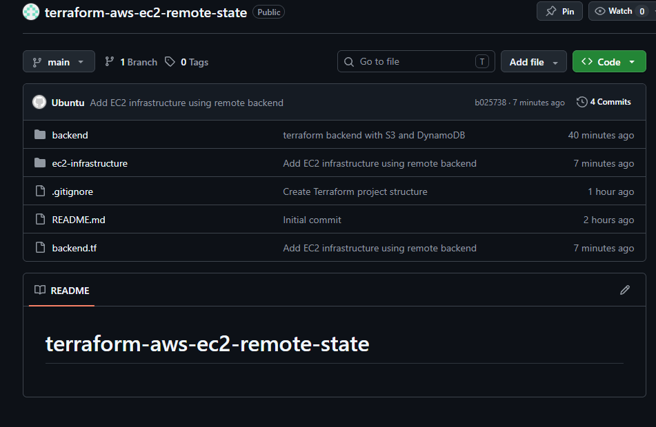
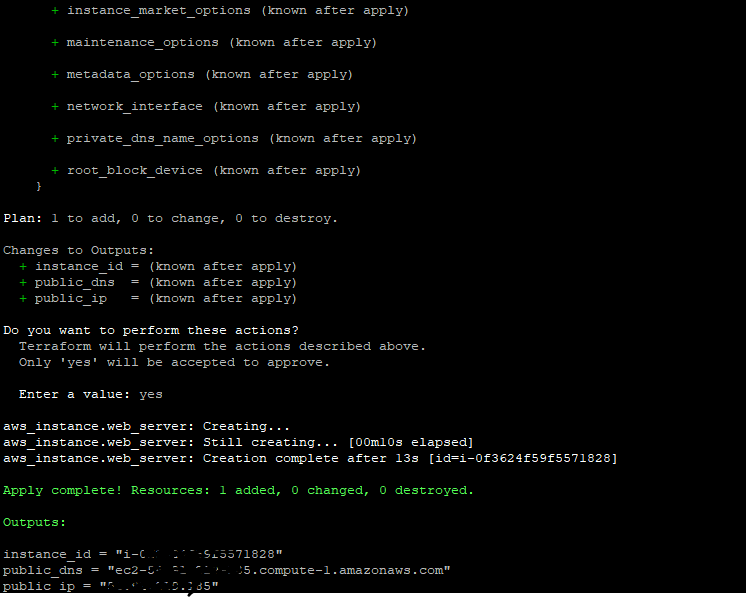
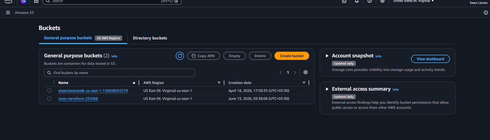
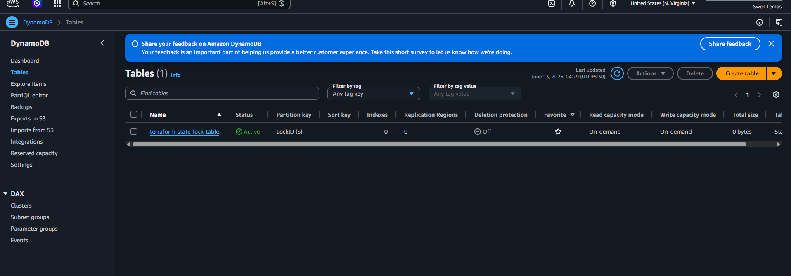
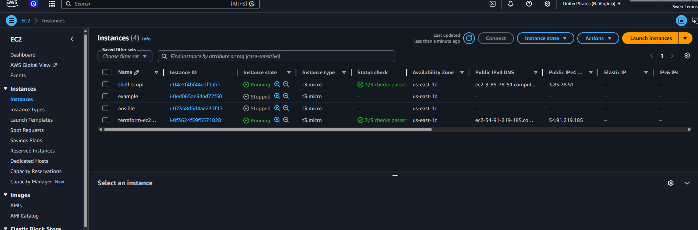
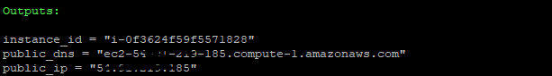

# Terraform AWS EC2 with Remote State Backend

## Project Overview

This project demonstrates Infrastructure as Code (IaC) using Terraform on AWS.

The project provisions:

* Amazon S3 Bucket for Terraform Remote State Storage
* DynamoDB Table for Terraform State Locking
* EC2 Instance
* Security Group for SSH Access

The infrastructure is fully managed through Terraform and version controlled using Git and GitHub.

---

## Architecture

Terraform Code

↓

S3 Bucket (Remote State)

↓

DynamoDB Table (State Locking)

↓

EC2 Instance

↓

Security Group

---

## Why Remote State?

Terraform stores infrastructure information inside a file called:

```text
terraform.tfstate
```

Storing state locally can cause:

* State loss
* Team collaboration issues
* State corruption

To solve this:

* Amazon S3 stores Terraform state remotely.
* DynamoDB provides state locking to prevent concurrent changes.

---

## Project Structure

```text
terraform-aws-ec2-remote-state/
│
├── backend/
│   ├── provider.tf
│   ├── main.tf
│   ├── variables.tf
│   ├── outputs.tf
│   └── terraform.tfvars.example
│
├── ec2-infrastructure/
│   ├── provider.tf
│   ├── backend.tf
│   ├── main.tf
│   ├── variables.tf
│   ├── outputs.tf
│   └── terraform.tfvars.example
│
├── screenshots/
│   ├── 1-github-repository.png
│   ├── 2-backend-terraform-apply.png
│   ├── s3-bucket-created.png
│   ├── dynamodb-table-created.png
│   ├── 6-ec2-instance-running.png
│   └── terraform-output.png
│
├── README.md
└── .gitignore
```

---

## Technologies Used

* Terraform
* AWS EC2
* AWS S3
* AWS DynamoDB
* Git
* GitHub
* Linux

---

## Backend Infrastructure

### Amazon S3

Used to store Terraform state remotely.

Features:

* Versioning Enabled
* Encryption Enabled
* Public Access Blocked

### DynamoDB

Used for Terraform state locking.

Benefits:

* Prevents simultaneous Terraform operations
* Maintains state consistency

---

## EC2 Infrastructure

The infrastructure module provisions:

* Amazon Linux EC2 Instance
* Security Group
* SSH Access

Terraform state is stored remotely in S3 while DynamoDB handles state locking.

---

## Terraform Workflow

Initialize Terraform:

```bash
terraform init
```

Format Configuration:

```bash
terraform fmt
```

Validate Configuration:

```bash
terraform validate
```

Preview Changes:

```bash
terraform plan
```

Create Infrastructure:

```bash
terraform apply
```

View Outputs:

```bash
terraform output
```

Destroy Infrastructure:

```bash
terraform destroy
```

---

## Git Workflow

Check Status:

```bash
git status
```

Stage Changes:

```bash
git add .
```

Commit Changes:

```bash
git commit -m "Commit Message"
```

Push Changes:

```bash
git push
```

---

## Screenshots

### GitHub Repository



### Terraform Apply



### S3 Bucket Created



### DynamoDB Table Created



### EC2 Instance Running



### Terraform Output



---

## Key Learnings

Through this project, I learned:

* Infrastructure as Code (IaC)
* Terraform State Management
* Remote State Storage
* State Locking using DynamoDB
* EC2 Provisioning using Terraform
* Security Group Configuration
* Git and GitHub Workflow
* AWS Resource Management
* Terraform Project Structure

---

## Author

**Swen Lemos**

Aspiring DevOps & Cloud Engineer
